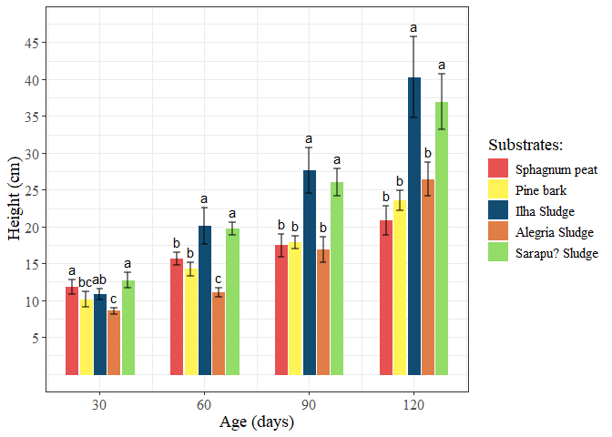
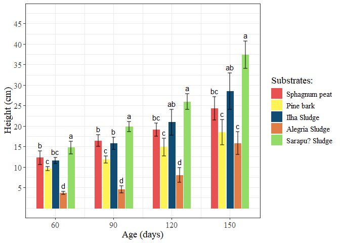
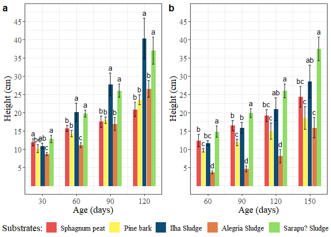
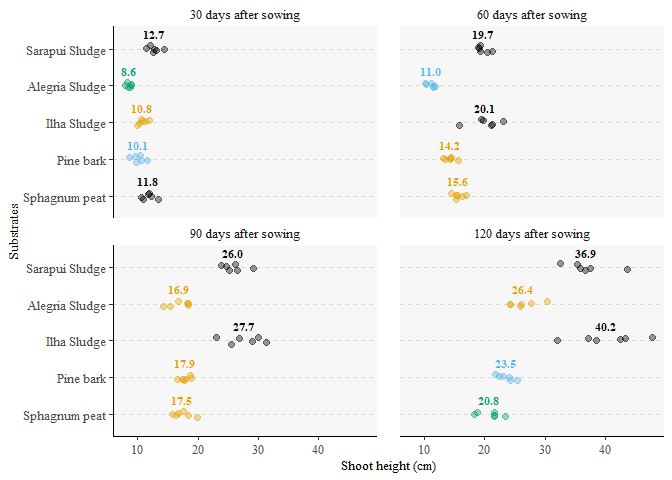
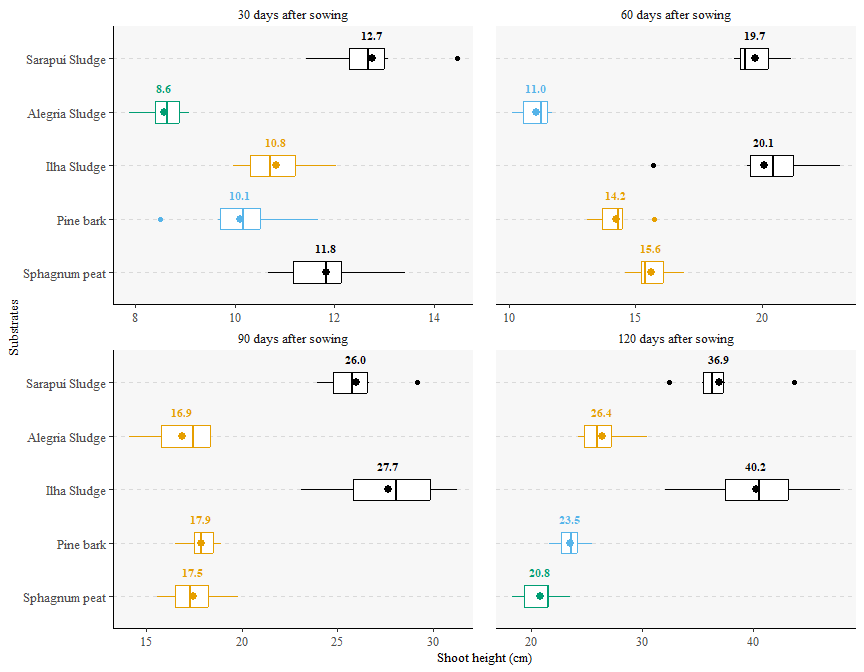
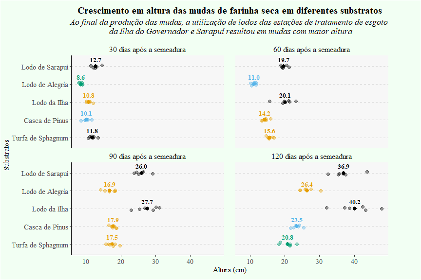

Gráficos - lodo qui/fis
================
Jorge Alonso
2024-08-09

## 1. Preparando para as análises

``` r
# Carregando pacotes
library(tidyverse)
```

    ## ── Attaching core tidyverse packages ──────────────────────── tidyverse 2.0.0 ──
    ## ✔ dplyr     1.1.4     ✔ readr     2.1.5
    ## ✔ forcats   1.0.0     ✔ stringr   1.5.1
    ## ✔ ggplot2   3.5.0     ✔ tibble    3.2.1
    ## ✔ lubridate 1.9.3     ✔ tidyr     1.3.1
    ## ✔ purrr     1.0.2     
    ## ── Conflicts ────────────────────────────────────────── tidyverse_conflicts() ──
    ## ✖ dplyr::filter() masks stats::filter()
    ## ✖ dplyr::lag()    masks stats::lag()
    ## ℹ Use the conflicted package (<http://conflicted.r-lib.org/>) to force all conflicts to become errors

``` r
library(ggpubr)
library(ExpDes.pt)
library(ggthemes)
```

``` r
# Limpando a memória
rm(list=ls(all=TRUE))
gc()
```

    ##           used (Mb) gc trigger (Mb) max used (Mb)
    ## Ncells  953347 51.0    1864134 99.6  1389182 74.2
    ## Vcells 1624035 12.4    8388608 64.0  2213481 16.9

``` r
# Carregando os dados
raw_url <- "https://raw.githubusercontent.com/jmalonso55/caracteristicas_lodo_figuras/main/Dados_experimento.csv"
dat <- read.csv(raw_url, sep = ";")
```

## 2. Gráficos originais

### 2.1. Farinha seca

``` r
# Filtrando para a farinha seca
far <- subset(dat, Esp == "Far")
```

``` r
# Filtrando e resumindo para farinha seca
farm<-setNames(aggregate(far$Alt, by=list(far$Trat, far$Ida), FUN=mean),
               c("Trat", "Ida", "H"))
sd<-setNames(aggregate(far$Alt, by=list(far$Trat, far$Ida), FUN=sd),
             c("Trat", "Ida", "sd"))
```

``` r
# Acrescentando novas colunas
farm$sd<-sd$sd
tuk<-c("a","bc","ab","c","a","b","b","a","c","a","b","b","a","b","a","b","b","a","b","a")
farm$tuk<-tuk
farm<-as.data.frame(farm)
```

``` r
# Gerando o gráfico
farg<-  ggplot(farm, aes(x=Ida, y=H, group=Trat)) + 
  geom_col(aes(color=factor(Trat), fill=factor(Trat)), position=position_dodge(20), width=17) +
  theme_bw() + 
  geom_errorbar(aes(ymin=H-sd, ymax=H+sd), position=position_dodge(20), 
                width=10, size=0.75, alpha=0.5) +
    theme(text=element_text(size=14,  family="serif"), 
          axis.text = element_text(size = 12, family="serif")) +
  scale_x_continuous(limits = c(20, 130), breaks = c(30, 60, 90, 120)) +
  scale_y_continuous(limits = c(0, 47.5), breaks = c(5,10,15,20,25,30,35,40,45)) +
  labs(y="Height (cm)", x="Age (days)") +
  geom_text(aes(label=tuk, y=H+sd), vjust = -0.5, position=position_dodge(20)) +
  scale_fill_manual(values=c("#e75151","#fff355","#114c73","#e17d47","#92dc67"), 
  name = "Substrates:", labels = c("Sphagnum peat", "Pine bark", "Ilha Sludge", 
                                   "Alegria Sludge", "Sarapu? Sludge"))+
  scale_color_manual(values=c("#e75151","#fff355","#114c73","#e17d47","#92dc67")) + 
  guides(color="none", fill=guide_legend(override.aes=list(color=NA)))
```

    ## Warning: Using `size` aesthetic for lines was deprecated in ggplot2 3.4.0.
    ## ℹ Please use `linewidth` instead.
    ## This warning is displayed once every 8 hours.
    ## Call `lifecycle::last_lifecycle_warnings()` to see where this warning was
    ## generated.

``` r
# Visualizando
farg
```

<!-- -->

### 2.2. Sobrasil

``` r
# Filtrando e resumindo para o sobrasil
sob<-subset(dat, Esp=="Sob")
sobm<-setNames(aggregate(sob$Alt, by=list(sob$Trat, sob$Ida), FUN=mean),
               c("Trat", "Ida", "H"))
ssd<-setNames(aggregate(sob$Alt, by=list(sob$Trat, sob$Ida), FUN=sd),
             c("Trat", "Ida", "sd"))
```

``` r
# Adicionando novas colunas
sobm$sd<-ssd$sd
tuks<-c("b","c","bc","d","a","b","c","b","d","a","bc","c","ab","d","a","bc","c","ab","c","a")
sobm$tuks<-tuks
sobm<-as.data.frame(sobm)
```

``` r
# Gerando o gráfico
sobg<- ggplot(sobm, aes(x=Ida, y=H, group=Trat)) + 
  geom_col(aes(color=factor(Trat), fill=factor(Trat)), position=position_dodge(20), width=17) +
  theme_bw() + 
  geom_errorbar(aes(ymin=H-sd, ymax=H+sd), position=position_dodge(20), 
                width=10, size=0.75, alpha=0.5) +
  theme(text=element_text(size=14,  family="serif"), 
        axis.text = element_text(size = 12, family="serif")) +
  scale_x_continuous(limits = c(50, 160), breaks = c(60, 90, 120, 150)) +
  scale_y_continuous(limits = c(0, 47.5), breaks = c(5,10,15,20,25,30,35,40,45)) +
  labs(y="Height (cm)", x="Age (days)") +
  geom_text(aes(label=tuks, y=H+sd), vjust = -0.5, position=position_dodge(20)) +
  scale_fill_manual(values=c("#e75151","#fff355","#114c73","#e17d47","#92dc67"), 
                    name = "Substrates:", labels = c("Sphagnum peat", "Pine bark", "Ilha Sludge", 
                                                     "Alegria Sludge", "Sarapu? Sludge"))+
  scale_color_manual(values=c("#e75151","#fff355","#114c73","#e17d47","#92dc67")) + 
  guides(color="none", fill=guide_legend(override.aes=list(color=NA)))

# Visualizando o gráfico
sobg
```

<!-- -->

``` r
# Juntando os gráficos
ggarrange(farg, sobg, labels = c("a", "b"), nrow = 1, ncol = 2, common.legend = TRUE, legend = "bottom")
```

<!-- -->

## 3. Reanalisando os dados

### 3.1. Farinha seca

``` r
# Recodificando os dados
far$Idade <- as.factor(far$Idade)
far$Trat <- as.factor(far$Trat)
far$Rep <- as.factor(far$Rep)
```

``` r
# Verificando o resumo
summary(far)
```

    ##      Esp            Trat   Rep    Idade         Alt       
    ##  Length:120         1:24   1:20   30 :30   Min.   : 7.88  
    ##  Class :character   2:24   2:20   60 :30   1st Qu.:12.17  
    ##  Mode  :character   3:24   3:20   90 :30   Median :18.11  
    ##                     4:24   4:20   120:30   Mean   :19.43  
    ##                     5:24   5:20            3rd Qu.:24.04  
    ##                            6:20            Max.   :47.83

#### 3.1.1. Checando os pressupostos

``` r
# Gerando um modelo para os pressupostos
mod_far <- aov(log(Alt) ~ Idade*Trat, data = far)
```

``` r
# Normalidade
shapiro.test(mod_far$residuals)
```

    ## 
    ##  Shapiro-Wilk normality test
    ## 
    ## data:  mod_far$residuals
    ## W = 0.9886, p-value = 0.418

``` r
# Homocedasticidade
with(far, bartlett.test(log(Alt), interaction(Idade, Trat)))
```

    ## 
    ##  Bartlett test of homogeneity of variances
    ## 
    ## data:  log(Alt) and interaction(Idade, Trat)
    ## Bartlett's K-squared = 19.394, df = 19, p-value = 0.4318

``` r
# Resumo dos resultados
summary(mod_far)
```

    ##              Df Sum Sq Mean Sq F value Pr(>F)    
    ## Idade         3 15.568   5.189  692.69 <2e-16 ***
    ## Trat          4  4.024   1.006  134.30 <2e-16 ***
    ## Idade:Trat   12  1.282   0.107   14.26 <2e-16 ***
    ## Residuals   100  0.749   0.007                   
    ## ---
    ## Signif. codes:  0 '***' 0.001 '**' 0.01 '*' 0.05 '.' 0.1 ' ' 1

#### 3.1.2. Análise por parcelas subdivididas

``` r
# Efetuando a análise
with(far, psub2.dic(Trat, as.numeric(Idade), Rep, log(Alt), quali = c(T, F), mcomp = "sk"))
```

    ## ------------------------------------------------------------------------
    ## Legenda:
    ## FATOR 1(parcela):  F1 
    ## FATOR 2 (subparcela):  F2 
    ## ------------------------------------------------------------------------
    ## 
    ## ------------------------------------------------------------------------
    ## Quadro da analise de variancia
    ## ------------------------------------------------------------------------
    ##         GL      SQ     QM      Fc   Pr(>Fc)    
    ## F1       4  4.0245 1.0061   48.88 < 2.2e-16 ***
    ## Erro a  25  0.5145 0.0206                      
    ## F2       3 15.5684 5.1895 1658.76 < 2.2e-16 ***
    ## F1*F2   12  1.2822 0.1068   34.15 < 2.2e-16 ***
    ## Erro b  75  0.2346 0.0031                      
    ## Total  119 21.6242                             
    ## ---
    ## Signif. codes:  0 '***' 0.001 '**' 0.01 '*' 0.05 '.' 0.1 ' ' 1
    ## ------------------------------------------------------------------------
    ## CV 1 = 4.98934 %
    ## CV 2 = 1.945417 %
    ## 
    ## ------------------------------------------------------------------------
    ## #Teste de normalidade dos residuos (Shapiro-Wilk)
    ## valor-p:  0.7343863 
    ## De acordo com o teste de Shapiro-Wilk a 5% de significancia, os residuos podem ser considerados normais.
    ## ------------------------------------------------------------------------
    ## 
    ## 
    ## 
    ## Interacao significativa: desdobrando a interacao
    ## ------------------------------------------------------------------------
    ## 
    ## Desdobrando  F1  dentro de cada nivel de  F2 
    ## ------------------------------------------------------------------------
    ##                     GL        SQ       QM        Fc valor.p
    ## F1 : F2 1       4.0000 0.5514010 0.137850  18.39965       0
    ## F1 : F2 2       4.0000 1.4570170 0.364254 48.619099       0
    ## F1 : F2 3       4.0000 1.3601000 0.340025 45.385062       0
    ## F1 : F2 4       4.0000 1.9381490 0.484537 64.673966       0
    ## Erro combinado 49.5685 0.3713672 0.007492                  
    ## ------------------------------------------------------------------------
    ## 
    ## 
    ##  F1 dentro de F2 1
    ## ------------------------------------------------------------------------
    ## Teste de Scott-Knott
    ## ------------------------------------------------------------------------
    ##   Grupos Tratamentos   Medias
    ## 1      a           5 2.542546
    ## 2      a           1 2.467163
    ## 3      b           3 2.379996
    ## 4      c           2 2.309051
    ## 5      d           4 2.148926
    ## ------------------------------------------------------------------------
    ## 
    ##  F1 dentro de F2 2
    ## ------------------------------------------------------------------------
    ## Teste de Scott-Knott
    ## ------------------------------------------------------------------------
    ##   Grupos Tratamentos   Medias
    ## 1      a           3 2.992221
    ## 2      a           5 2.980521
    ## 3      b           1 2.747658
    ## 4      b           2 2.653979
    ## 5      c           4 2.400820
    ## ------------------------------------------------------------------------
    ## 
    ##  F1 dentro de F2 3
    ## ------------------------------------------------------------------------
    ## Teste de Scott-Knott
    ## ------------------------------------------------------------------------
    ##   Grupos Tratamentos   Medias
    ## 1      a           3 3.314667
    ## 2      a           5 3.255059
    ## 3      b           2 2.882479
    ## 4      b           1 2.857445
    ## 5      b           4 2.821360
    ## ------------------------------------------------------------------------
    ## 
    ##  F1 dentro de F2 4
    ## ------------------------------------------------------------------------
    ## Teste de Scott-Knott
    ## ------------------------------------------------------------------------
    ##   Grupos Tratamentos   Medias
    ## 1      a           3 3.687079
    ## 2      a           5 3.605178
    ## 3      b           4 3.271722
    ## 4      c           2 3.156283
    ## 5      d           1 3.032769
    ## ------------------------------------------------------------------------
    ## 
    ## 
    ## Desdobrando  F2  dentro de cada nivel de  F1 
    ## ------------------------------------------------------------------------
    ##            GL       SQ       QM         Fc valor.p
    ## F2 : F1 1   3 1.012482 0.337494 107.859976       0
    ## F2 : F1 2   3 2.317630 0.772543 246.897813       0
    ## F2 : F1 3   3 5.523573 1.841191 588.427928       0
    ## F2 : F1 4   3 4.371656 1.457219 465.713812       0
    ## F2 : F1 5   3 3.625250 1.208417 386.198971       0
    ## Erro b     75 0.234639 0.003129                   
    ## ------------------------------------------------------------------------
    ## 
    ## 
    ##  F2 dentro de F1 1
    ## ------------------------------------------------------------------------
    ## Ajuste de modelos polinomiais de regressao
    ## ------------------------------------------------------------------------
    ## 
    ## Modelo Linear
    ## =========================================
    ##    Estimativa Erro.padrao   tc    valor.p
    ## -----------------------------------------
    ## b0   2.3246     0.0280    83.1209    0   
    ## b1   0.1807     0.0102    17.6911    0   
    ## -----------------------------------------
    ## 
    ## R2 do modelo linear
    ## --------
    ## 0.967076
    ## --------
    ## 
    ## Analise de variancia do modelo linear
    ## ====================================================
    ##                      GL   SQ     QM     Fc   valor.p
    ## ----------------------------------------------------
    ## Efeito linear        1  0.9792 0.9792 312.97    0   
    ## Desvios de Regressao 2  0.0333 0.0167  5.33  0.00686
    ## Residuos             75 0.2346 0.0031               
    ## ----------------------------------------------------
    ## ------------------------------------------------------------------------
    ## 
    ## Modelo quadratico
    ## =========================================
    ##    Estimativa Erro.padrao   tc    valor.p
    ## -----------------------------------------
    ## b0   2.1931     0.0636    34.5003    0   
    ## b1   0.3121     0.0580    5.3821     0   
    ## b2  -0.0263     0.0114    -2.3029 0.0241 
    ## -----------------------------------------
    ## 
    ## R2 do modelo quadratico
    ## --------
    ## 0.983462
    ## --------
    ## 
    ## Analise de variancia do modelo quadratico
    ## ====================================================
    ##                      GL   SQ     QM     Fc   valor.p
    ## ----------------------------------------------------
    ## Efeito linear        1  0.9792 0.9792 312.97    0   
    ## Efeito quadratico    1  0.0166 0.0166  5.3   0.02406
    ## Desvios de Regressao 1  0.0167 0.0167  5.35  0.02344
    ## Residuos             75 0.2346 0.0031               
    ## ----------------------------------------------------
    ## ------------------------------------------------------------------------
    ## 
    ## Modelo cubico
    ## =========================================
    ##    Estimativa Erro.padrao   tc    valor.p
    ## -----------------------------------------
    ## b0   1.7797     0.1897    9.3828     0   
    ## b1   0.9697     0.2901    3.3427  0.0013 
    ## b2  -0.3216     0.1282    -2.5094 0.0142 
    ## b3   0.0394     0.0170    2.3134  0.0234 
    ## -----------------------------------------
    ## 
    ## R2 do modelo cubico
    ## -
    ## 1
    ## -
    ## 
    ## Analise de variancia do modelo cubico
    ## ====================================================
    ##                      GL   SQ     QM     Fc   valor.p
    ## ----------------------------------------------------
    ## Efeito linear        1  0.9792 0.9792 312.97    0   
    ## Efeito quadratico    1  0.0166 0.0166  5.3   0.02406
    ## Efeito cubico        1  0.0167 0.0167  5.35  0.02344
    ## Desvios de Regressao 0    0      0      0       1   
    ## Residuos             75 0.2346 0.0031               
    ## ----------------------------------------------------
    ## ------------------------------------------------------------------------
    ## 
    ##  F2 dentro de F1 2
    ## ------------------------------------------------------------------------
    ## Ajuste de modelos polinomiais de regressao
    ## ------------------------------------------------------------------------
    ## 
    ## Modelo Linear
    ## =========================================
    ##    Estimativa Erro.padrao   tc    valor.p
    ## -----------------------------------------
    ## b0   2.0579     0.0280    73.5842    0   
    ## b1   0.2770     0.0102    27.1270    0   
    ## -----------------------------------------
    ## 
    ## R2 do modelo linear
    ## --------
    ## 0.993340
    ## --------
    ## 
    ## Analise de variancia do modelo linear
    ## ====================================================
    ##                      GL   SQ     QM     Fc   valor.p
    ## ----------------------------------------------------
    ## Efeito linear        1  2.3022 2.3022 735.87    0   
    ## Desvios de Regressao 2  0.0154 0.0077  2.47  0.09171
    ## Residuos             75 0.2346 0.0031               
    ## ----------------------------------------------------
    ## ------------------------------------------------------------------------
    ## 
    ## Modelo quadratico
    ## =========================================
    ##    Estimativa Erro.padrao   tc    valor.p
    ## -----------------------------------------
    ## b0   1.9690     0.0636    30.9742    0   
    ## b1   0.3659     0.0580    6.3098     0   
    ## b2  -0.0178     0.0114    -1.5574 0.1236 
    ## -----------------------------------------
    ## 
    ## R2 do modelo quadratico
    ## --------
    ## 0.996614
    ## --------
    ## 
    ## Analise de variancia do modelo quadratico
    ## ====================================================
    ##                      GL   SQ     QM     Fc   valor.p
    ## ----------------------------------------------------
    ## Efeito linear        1  2.3022 2.3022 735.87    0   
    ## Efeito quadratico    1  0.0076 0.0076  2.43  0.12359
    ## Desvios de Regressao 1  0.0078 0.0078  2.51  0.11745
    ## Residuos             75 0.2346 0.0031               
    ## ----------------------------------------------------
    ## ------------------------------------------------------------------------
    ## 
    ## Modelo cubico
    ## =========================================
    ##    Estimativa Erro.padrao   tc    valor.p
    ## -----------------------------------------
    ## b0   1.6860     0.1897    8.8885     0   
    ## b1   0.8161     0.2901    2.8132  0.0063 
    ## b2  -0.2199     0.1282    -1.7162 0.0902 
    ## b3   0.0270     0.0170    1.5837  0.1175 
    ## -----------------------------------------
    ## 
    ## R2 do modelo cubico
    ## -
    ## 1
    ## -
    ## 
    ## Analise de variancia do modelo cubico
    ## ====================================================
    ##                      GL   SQ     QM     Fc   valor.p
    ## ----------------------------------------------------
    ## Efeito linear        1  2.3022 2.3022 735.87    0   
    ## Efeito quadratico    1  0.0076 0.0076  2.43  0.12359
    ## Efeito cubico        1  0.0078 0.0078  2.51  0.11746
    ## Desvios de Regressao 0    0      0      0       1   
    ## Residuos             75 0.2346 0.0031               
    ## ----------------------------------------------------
    ## ------------------------------------------------------------------------
    ## 
    ##  F2 dentro de F1 3
    ## ------------------------------------------------------------------------
    ## Ajuste de modelos polinomiais de regressao
    ## ------------------------------------------------------------------------
    ## 
    ## Modelo Linear
    ## =========================================
    ##    Estimativa Erro.padrao   tc    valor.p
    ## -----------------------------------------
    ## b0   2.0326     0.0280    72.6784    0   
    ## b1   0.4244     0.0102    41.5561    0   
    ## -----------------------------------------
    ## 
    ## R2 do modelo linear
    ## --------
    ## 0.978113
    ## --------
    ## 
    ## Analise de variancia do modelo linear
    ## =====================================================
    ##                      GL   SQ     QM     Fc    valor.p
    ## -----------------------------------------------------
    ## Efeito linear        1  5.4027 5.4027 1726.91    0   
    ## Desvios de Regressao 2  0.1209 0.0604  19.32     0   
    ## Residuos             75 0.2346 0.0031                
    ## -----------------------------------------------------
    ## ------------------------------------------------------------------------
    ## 
    ## Modelo quadratico
    ## =========================================
    ##    Estimativa Erro.padrao   tc    valor.p
    ## -----------------------------------------
    ## b0   1.7328     0.0636    27.2586    0   
    ## b1   0.7241     0.0580    12.4867    0   
    ## b2  -0.0600     0.0114    -5.2511    0   
    ## -----------------------------------------
    ## 
    ## R2 do modelo quadratico
    ## --------
    ## 0.993731
    ## --------
    ## 
    ## Analise de variancia do modelo quadratico
    ## =====================================================
    ##                      GL   SQ     QM     Fc    valor.p
    ## -----------------------------------------------------
    ## Efeito linear        1  5.4027 5.4027 1726.91    0   
    ## Efeito quadratico    1  0.0863 0.0863  27.57     0   
    ## Desvios de Regressao 1  0.0346 0.0346  11.07  0.00136
    ## Residuos             75 0.2346 0.0031                
    ## -----------------------------------------------------
    ## ------------------------------------------------------------------------
    ## 
    ## Modelo cubico
    ## =========================================
    ##    Estimativa Erro.padrao   tc    valor.p
    ## -----------------------------------------
    ## b0   1.1383     0.1897    6.0009     0   
    ## b1   1.6698     0.2901    5.7560     0   
    ## b2  -0.4846     0.1282    -3.7815 0.0003 
    ## b3   0.0566     0.0170    3.3269  0.0014 
    ## -----------------------------------------
    ## 
    ## R2 do modelo cubico
    ## -
    ## 1
    ## -
    ## 
    ## Analise de variancia do modelo cubico
    ## =====================================================
    ##                      GL   SQ     QM     Fc    valor.p
    ## -----------------------------------------------------
    ## Efeito linear        1  5.4027 5.4027 1726.91    0   
    ## Efeito quadratico    1  0.0863 0.0863  27.57     0   
    ## Efeito cubico        1  0.0346 0.0346  11.07  0.00136
    ## Desvios de Regressao 0    0      0       0       1   
    ## Residuos             75 0.2346 0.0031                
    ## -----------------------------------------------------
    ## ------------------------------------------------------------------------
    ## 
    ##  F2 dentro de F1 4
    ## ------------------------------------------------------------------------
    ## Ajuste de modelos polinomiais de regressao
    ## ------------------------------------------------------------------------
    ## 
    ## Modelo Linear
    ## =========================================
    ##    Estimativa Erro.padrao   tc    valor.p
    ## -----------------------------------------
    ## b0   1.7135     0.0280    61.2686    0   
    ## b1   0.3789     0.0102    37.1029    0   
    ## -----------------------------------------
    ## 
    ## R2 do modelo linear
    ## --------
    ## 0.985162
    ## --------
    ## 
    ## Analise de variancia do modelo linear
    ## =====================================================
    ##                      GL   SQ     QM     Fc    valor.p
    ## -----------------------------------------------------
    ## Efeito linear        1  4.3068 4.3068 1376.62    0   
    ## Desvios de Regressao 2  0.0649 0.0324  10.37  0.00011
    ## Residuos             75 0.2346 0.0031                
    ## -----------------------------------------------------
    ## ------------------------------------------------------------------------
    ## 
    ## Modelo quadratico
    ## =========================================
    ##    Estimativa Erro.padrao   tc    valor.p
    ## -----------------------------------------
    ## b0   1.9616     0.0636    30.8572    0   
    ## b1   0.1308     0.0580    2.2556  0.0270 
    ## b2   0.0496     0.0114    4.3458  0.00004
    ## -----------------------------------------
    ## 
    ## R2 do modelo quadratico
    ## --------
    ## 0.998677
    ## --------
    ## 
    ## Analise de variancia do modelo quadratico
    ## =====================================================
    ##                      GL   SQ     QM     Fc    valor.p
    ## -----------------------------------------------------
    ## Efeito linear        1  4.3068 4.3068 1376.62    0   
    ## Efeito quadratico    1  0.0591 0.0591  18.89   4e-05 
    ## Desvios de Regressao 1  0.0058 0.0058  1.85   0.17807
    ## Residuos             75 0.2346 0.0031                
    ## -----------------------------------------------------
    ## ------------------------------------------------------------------------
    ## 
    ## Modelo cubico
    ## =========================================
    ##    Estimativa Erro.padrao   tc    valor.p
    ## -----------------------------------------
    ## b0   2.2045     0.1897    11.6223    0   
    ## b1  -0.2556     0.2901    -0.8810 0.3811 
    ## b2   0.2231     0.1282    1.7412  0.0858 
    ## b3  -0.0231     0.0170    -1.3594 0.1781 
    ## -----------------------------------------
    ## 
    ## R2 do modelo cubico
    ## -
    ## 1
    ## -
    ## 
    ## Analise de variancia do modelo cubico
    ## =====================================================
    ##                      GL   SQ     QM     Fc    valor.p
    ## -----------------------------------------------------
    ## Efeito linear        1  4.3068 4.3068 1376.62    0   
    ## Efeito quadratico    1  0.0591 0.0591  18.89   4e-05 
    ## Efeito cubico        1  0.0058 0.0058  1.85   0.17809
    ## Desvios de Regressao 0    0      0       0       1   
    ## Residuos             75 0.2346 0.0031                
    ## -----------------------------------------------------
    ## ------------------------------------------------------------------------
    ## 
    ##  F2 dentro de F1 5
    ## ------------------------------------------------------------------------
    ## Ajuste de modelos polinomiais de regressao
    ## ------------------------------------------------------------------------
    ## 
    ## Modelo Linear
    ## =========================================
    ##    Estimativa Erro.padrao   tc    valor.p
    ## -----------------------------------------
    ## b0   2.2302     0.0280    79.7458    0   
    ## b1   0.3462     0.0102    33.9057    0   
    ## -----------------------------------------
    ## 
    ## R2 do modelo linear
    ## --------
    ## 0.992078
    ## --------
    ## 
    ## Analise de variancia do modelo linear
    ## ====================================================
    ##                      GL   SQ     QM     Fc   valor.p
    ## ----------------------------------------------------
    ## Efeito linear        1  3.5965 3.5965 1149.6    0   
    ## Desvios de Regressao 2  0.0287 0.0144  4.59  0.01317
    ## Residuos             75 0.2346 0.0031               
    ## ----------------------------------------------------
    ## ------------------------------------------------------------------------
    ## 
    ## Modelo quadratico
    ## =========================================
    ##    Estimativa Erro.padrao   tc    valor.p
    ## -----------------------------------------
    ## b0   2.1204     0.0636    33.3559    0   
    ## b1   0.4561     0.0580    7.8642     0   
    ## b2  -0.0220     0.0114    -1.9238 0.0582 
    ## -----------------------------------------
    ## 
    ## R2 do modelo quadratico
    ## --------
    ## 0.995272
    ## --------
    ## 
    ## Analise de variancia do modelo quadratico
    ## ====================================================
    ##                      GL   SQ     QM     Fc   valor.p
    ## ----------------------------------------------------
    ## Efeito linear        1  3.5965 3.5965 1149.6    0   
    ## Efeito quadratico    1  0.0116 0.0116  3.7   0.05818
    ## Desvios de Regressao 1  0.0171 0.0171  5.48  0.02191
    ## Residuos             75 0.2346 0.0031               
    ## ----------------------------------------------------
    ## ------------------------------------------------------------------------
    ## 
    ## Modelo cubico
    ## =========================================
    ##    Estimativa Erro.padrao   tc    valor.p
    ## -----------------------------------------
    ## b0   1.7021     0.1897    8.9737     0   
    ## b1   1.1213     0.2901    3.8655  0.0002 
    ## b2  -0.3207     0.1282    -2.5027 0.0145 
    ## b3   0.0398     0.0170    2.3406  0.0219 
    ## -----------------------------------------
    ## 
    ## R2 do modelo cubico
    ## -
    ## 1
    ## -
    ## 
    ## Analise de variancia do modelo cubico
    ## ====================================================
    ##                      GL   SQ     QM     Fc   valor.p
    ## ----------------------------------------------------
    ## Efeito linear        1  3.5965 3.5965 1149.6    0   
    ## Efeito quadratico    1  0.0116 0.0116  3.7   0.05818
    ## Efeito cubico        1  0.0171 0.0171  5.48  0.02191
    ## Desvios de Regressao 0    0      0      0       1   
    ## Residuos             75 0.2346 0.0031               
    ## ----------------------------------------------------
    ## ------------------------------------------------------------------------

## 4. Gerando os gráficos

``` r
# Criando uma tabela de correspondência
tab_corres <- tibble::tibble(
  Trat = c("1", "2", "3", "4", "5"),
  "30" = c("a", "c", "b", "d", "a"),
  "60" = c("b", "b", "a", "c", "a"),
  "90" = c("b", "b", "a", "b", "a"),
  "120" = c("d", "c", "a", "b", "a")
)

# Realizando o join para adicionar a coluna teste_f
far <- far %>%
  left_join(tab_corres, by = "Trat") %>%
  mutate(teste_sk = case_when(
    Idade == "30" ~ `30`,
    Idade == "60" ~ `60`,
    Idade == "90" ~ `90`,
    Idade == "120" ~ `120`,
    TRUE ~ NA_character_
  )) %>%
  select(-"30", -"60", -"90", -"120")
```

### 4.1. Gráfico para o artigo

``` r
# Gráfico para o artigo
ggplot(data = far, aes(x = Trat, y = Alt, color = teste_sk)) +
  geom_jitter(alpha = 0.4, width = 0.1, height = 0.1, size = 2) +
  stat_summary(fun = mean, geom = "text", aes(label = sprintf("%.1f", after_stat(y))), position = position_nudge(x = 0.4), family = "serif", fontface = "bold", size = 3) +
  scale_x_discrete(labels = c("Sphagnum peat", "Pine bark", "Ilha Sludge", "Alegria Sludge", "Sarapuí Sludge")) +
  scale_color_colorblind() + 
  coord_flip() +
  facet_wrap(~Idade, labeller = labeller(Idade = c("30" = "30 days after sowing", "60" = "60 days after sowing", "90" = "90 days after sowing", "120" = "120 days after sowing"))) +
  labs(x = "Substrates", y = "Shoot height (cm)") +
  theme_classic() +
  theme(legend.position = "none",
      text = element_text(family = "serif", size = 10), 
      axis.text = element_text(size = 10, family="serif"),
      panel.background = element_rect(fill = "grey97"), 
      panel.grid.major.y = element_line(color = "grey85", linetype = "dashed"),
      panel.spacing.x = unit(0.6, "cm"),
      strip.text = element_text(size = 10, margin = margin(b = 5)),
      strip.background = element_blank())
```

<!-- -->

Com esse gráfico é possível visualizar toda o conjunto de dados gerados
no experimento, visto que cada um dos pontos do geom_jitter corresponde
a uma das observações. A média é representada pelo seu valor, assim é
possível observar tendência central e dispersão dos dados. Não há
legenda no gráfico, além de outros elementos que foram retirados. Ao
invés de letras, cores são utilizadas para identificar tratamentos com
médias diferentes pelo teste de Scott-Knott (p \< 0.05). As cores
utilizadas são identificáveis por pessoas com discromatopsia.

### 4.2. Alternativa usando boxplot

``` r
# Boxplot como alternativa ao jitter
ggplot(data = far, aes(x = Trat, y = Alt, color = teste_sk)) +
  geom_boxplot(width = 0.4) +
  stat_summary(fun = mean, geom = "text", aes(label = sprintf("%.1f", after_stat(y))), position = position_nudge(x = 0.45), family = "serif", fontface = "bold", size = 3) +
  stat_summary(fun = mean, geom = "point", size = 2.5) +
  scale_x_discrete(labels = c("Sphagnum peat", "Pine bark", "Ilha Sludge", "Alegria Sludge", "Sarapuí Sludge")) +
  scale_color_colorblind() + 
  coord_flip() +
  facet_wrap(~Idade, scales = "free_x", labeller = labeller(Idade = c("30" = "30 days after sowing", "60" = "60 days after sowing", "90" = "90 days after sowing", "120" = "120 days after sowing"))) +
  labs(x = "Substrates", y = "Shoot height (cm)") +
  theme_classic() +
  theme(legend.position = "none",
      text = element_text(family = "serif", size = 10), 
      axis.text = element_text(size = 10, family="serif"),
      panel.background = element_rect(fill = "grey97"), 
      panel.grid.major.y = element_line(color = "grey85", linetype = "dashed"),
      panel.spacing.x = unit(0.6, "cm"),
      strip.text = element_text(size = 10, margin = margin(b = 5)),
      strip.background = element_blank())
```

<!-- -->

Em trabalhos científicos, alguns pesquisadores preferem utilizar
boxplot. A representação gráfica dos quartis permitem ter ideia da
tendência cetral, dispersão dos dados, assimetria e por fim identificar
valores discrepantes. Para contrastar com o gráfico anterior e permitir
melhor interpretação da altura dentro de cada idade, os valores do eixo
x mudam de painel para painel e não começam no zero. Manipular os eixos
dessa forma pode assentuar diferenças entre tratamentos. No entanto, o
resultado do teste de comparações múltiplas, ilustrado pelas cores,
respalda a manipulação do eixo, já que ele é uma evidência confiável da
diferença entre as médias.

### 4.3. Alternativa com grid

``` r
# Gráfico com grid
ggplot(data = far, aes(x = Trat, y = Alt, color = teste_sk)) +
  geom_jitter(alpha = 0.4, width = 0.1, height = 0.1, size = 2) +
  stat_summary(fun = mean, geom = "text", aes(label = sprintf("%.1f", after_stat(y))), position = position_nudge(x = 0.4), family = "serif", fontface = "bold", size = 3) +
  stat_summary(fun = mean, geom = "point", size = 2.5) +
  scale_x_discrete(labels = c("SP", "PB", "IS", "AS", "SS")) +
  scale_color_colorblind() + 
  facet_grid(~Idade, labeller = labeller(Idade = c("30" = "30 days after sowing", "60" = "60 days after sowing", "90" = "90 days after sowing", "120" = "120 days after sowing"))) +
  labs(x = "Substrates", y = "Shoot height (cm)") +
  theme_classic() +
  theme(legend.position = "none",
      text = element_text(family = "serif", size = 10), 
      axis.text = element_text(size = 10, family="serif"),
      panel.background = element_rect(fill = "grey97"), 
      panel.grid.major.x = element_line(color = "grey85", linetype = "dotted"),
      panel.grid.major.y = element_line(color = "grey85", linetype = "dotted"),
      panel.spacing.x = unit(0.6, "cm"),
      strip.text = element_text(size = 10, margin = margin(b = 5)),
      strip.background = element_blank())
```

<!-- -->

Uma terceira alternativa é o uso de facet_grid ao invés de facet_wrap.
Essa opção confere uma melhor noção do crescimento das mudas de uma
época para a outra.

### 4.4. Gráfico para uma apresentação

``` r
# Gráfico para apresentação
ggplot(data = far, aes(x = Trat, y = Alt, color = teste_sk)) +
  geom_jitter(alpha = 0.4, width = 0.1, height = 0.1, size = 2) +
  stat_summary(fun = mean, geom = "text", aes(label = sprintf("%.1f", after_stat(y))), position = position_nudge(x = 0.4), family = "serif", fontface = "bold", size = 3.5) +
  stat_summary(fun = mean, geom = "point", size = 2.5) +
  scale_x_discrete(labels = c("Turfa de Sphagnum", "Casca de Pinus", "Lodo da Ilha", "Lodo de Alegria", "Lodo de Sarapuí")) +
  scale_color_colorblind() + 
  coord_flip() +
  facet_wrap(~Idade, labeller = labeller(Idade = c("30" = "30 dias após a semeadura", "60" = "60 dias após a semeadura", "90" = "90 dias após a semeadura", "120" = "120 dias após a semeadura"))) +
  labs(x = "Substratos", y = "Altura (cm)", title = "Crescimento em altura das mudas de farinha seca em diferentes substratos", subtitle = "Ao final da produção das mudas, a utilização de lodos das estações de tratamento de esgoto \n da Ilha do Governador e Sarapuí resultou em mudas com maior altura") +
  theme_classic() +
  theme(legend.position = "none",
      text = element_text(family = "serif", size = 11), 
      axis.text = element_text(size = 11, family="serif"),
      plot.title = element_text(hjust = 0.5, face = "bold", size = 15),
      plot.subtitle = element_text(hjust = 0.5, face = "italic", size = 13, margin = margin(b = 15)),
      plot.background = element_rect(fill = "#F2FFF3"),
      panel.background = element_rect(fill = "grey97"), 
      panel.grid.major.y = element_line(color = "grey85", linetype = "dashed"),
      panel.spacing.x = unit(0.6, "cm"),
      strip.text = element_text(size = 12, margin = margin(b = 5)),
      strip.background = element_blank(),
      plot.margin = margin(t = 10, b = 10, l = 5, r = 50))
```

<!-- -->

Por fim, esse gráfico seria a escolha para uma apresentação de aula ou
dos resultados em congresso, por exemplo. Além do fundo colorido, o
título e subtítulo fornecem ao observador informações para entender o
gráfico e os resultados.
